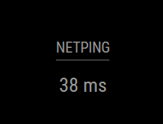

# MMM-PingTime

A module for the [MagicMirror](https://github.com/MagicMirrorOrg/MagicMirror) to display the ping duration to the [websocket.org](https://websocket.org/tools/websocket-echo-server/) or a Custom websocket echo server in ms.

## Previews




### Setup

Download the module:

```shell
cd ~/MagicMirror/modules 
git clone https://github.com/Protonosgit/MMM-PingTime
```

### Configuration

Add the module configuration to your `config.js` file.

```js
{
  module: 'MMM-PingTime',
  position: 'top_center',
  headder:'Network',
  config: {
    // See options bellow :)
  }
},
```

### Config Options

Purely optional:

| Option |  Description | Default | Required |
|---|---|---|---|
| `websocketUrl` | Host your own ping server (this shouldn't be changed) | `wss://echo.websocket.org`| False ||
| `updateInterval` | The interval in which ping requests are sent  | `6000` (6 sec)| False ||
| `timePrefix` | The string which will be displayed before the ping  || False ||
| `timeSuffix` | The string which will be displayed after the ping  | `ms`| False ||
| `connectedText` | The text which is shown after connecting  | `Connected`| False ||
| `disconnectedText` | The string which is shown while offline  | `Disconnected`| False ||
| `fontColor` | Changes the default text color  | `--color-text`| False ||
| `fontSize` | Changes the default font size  | `1`| False ||

### Host your own ping server

If you would like to host your own websocket endpoint you need to make sure, that it is set up as an echo server!<br>
Once the client sends the string: `ping` to the server, the same message should be returned.<br>
The official websocket source should work fine though (in most cases).


### [Example server:](https://socket.io/docs/v4/server-api/)

<b>Python<b>

```python
import asyncio
import websockets

async def handle_connection(websocket, path):
    try:
        async for message in websocket:
            if message.lower() == "ping":
                await websocket.send("ping")
    except websockets.exceptions.ConnectionClosedError:
        pass

async def main():
    server = await websockets.serve(handle_connection, "localhost", 8765)
    await server.wait_closed()

if __name__ == "__main__":
    asyncio.run(main())

```

<b>Javascript<b>

```js
const WebSocket = require('ws');

const wss = new WebSocket.Server({ port: 8765 });

wss.on('connection', function connection(ws) {

  ws.on('message', function incoming(message) {
    console.log('Ping received: %s', message);

    if (message.toString().toLowerCase() === 'ping') {
      ws.send('ping');
    }
  });

});

```

### Contributions
are always wellcome so feel free to participate!
: )